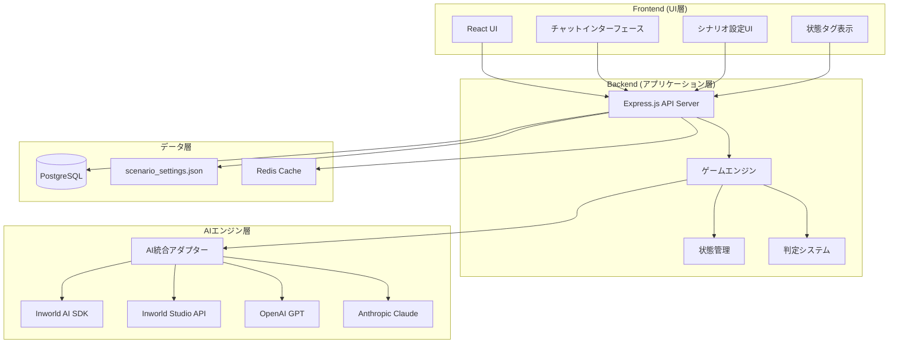

# 設計文書

## 概要

本文書は、プレイヤーが「物語の主人公」になる体験に完全に没入できる、次世代のAI駆動型TRPGプラットフォームの技術設計を概説します。GEMINI案を基に、Inworld AI SDKを中核とした実装可能な設計を提供します。

## アーキテクチャ

### システムアーキテクチャ

本システムは、責務を明確に分離した3層アーキテクチャを採用します：

1. **フロントエンド (UI層)**
   - プレイヤーが直接操作するWebインターフェース
   - React等のモダンなフレームワークで構築
   - リアルタイムチャットインターフェース
   - シナリオ設定フォーム
   - キャンペーン管理ダッシュボード

2. **バックエンド (アプリケーション層)**
   - ゲームロジック、状態管理、AIとの通信を司るAPIサーバー
   - Node.js (Express) + TypeScriptで構築
   - 認証とセッション管理
   - データ永続化機能

3. **AIエンジン層**
   - 第一選択：Inworld AIプラットフォーム（内蔵メモリ機能付き）
   - 代替：OpenAI GPT、Claude、その他のLLMサービス
   - キャラクターの認知、思考、対話生成を担当

### システム全体構成



### 技術スタック

**フロントエンド:**
- React + TypeScript
- WebSocketによるリアルタイム通信
- Tailwind CSS for styling

**バックエンド:**
- Node.js + Express + TypeScript
- Socket.io for real-time WebSocket communication
- Prisma ORM for database operations

**データベース:**
- PostgreSQL（永続化ストレージ）
- Redis（キャッシュ・セッション管理）

**AI統合:**
- Inworld AI Node.js SDK（第一選択）
- Inworld Studio REST API（GM自動設定用）
- OpenAI API（代替）
- Anthropic Claude API（代替）

## コンポーネントとインターフェース

### フロントエンドコンポーネント

#### 1. GameInterface
- **責任**: メインゲーム画面の管理
- **プロパティ**: campaignId, gameState
- **子コンポーネント**: ChatLog, ActionInput, StatusPanel

#### 2. ChatLog
- **責任**: 会話履歴の表示
- **プロパティ**: messages, isLoading
- **機能**: 自動スクロール、メッセージタイプ別スタイリング

#### 3. ActionInput
- **責任**: プレイヤーの行動入力
- **プロパティ**: onSubmit, disabled
- **機能**: 自然言語入力、送信状態管理

#### 4. StatusPanel
- **責任**: キャラクター状態タグの表示
- **プロパティ**: statusTags
- **機能**: タグの視覚的表示、ツールチップ

#### 5. ScenarioSettings
- **責任**: シナリオ設定フォーム
- **プロパティ**: onSave, initialSettings
- **機能**: フォーム検証、プレビュー機能

### バックエンドサービス

#### 1. GameService
```typescript
interface GameService {
  processPlayerAction(campaignId: string, action: string): Promise<GameResponse>
  getCampaignState(campaignId: string): Promise<CampaignState>
  createCampaign(settings: ScenarioSettings): Promise<Campaign>
  saveCampaignState(campaignId: string, state: CampaignState): Promise<void>
}
```

#### 2. AIService
```typescript
interface AIService {
  generateResponse(context: GameContext): Promise<AIResponse>
  calculateDifficulty(action: string, statusTags: string[]): Promise<number>
  updateStatusTags(currentTags: string[], gameEvent: GameEvent): Promise<string[]>
}
```

#### 3. CampaignService
```typescript
interface CampaignService {
  createCampaign(settings: ScenarioSettings): Promise<Campaign>
  loadCampaign(campaignId: string): Promise<Campaign>
  saveCampaign(campaign: Campaign): Promise<void>
  listCampaigns(userId: string): Promise<Campaign[]>
}
```

## データモデル

### シナリオ設定スキーマ (scenario_settings.json)

キャンペーン開始時に読み込まれる設定ファイル：

```json
{
  "campaignTitle": "string",
  "gmProfile": {
    "personality": "string (例: 公平無私だが皮肉屋)",
    "speechStyle": "string (例: 荘厳な口調)",
    "guidingPrinciples": ["string"]
  },
  "worldSettings": {
    "toneAndManner": "string (例: ダークファンタジー)",
    "keyConcepts": ["string"]
  },
  "opening": {
    "prologue": "string",
    "initialStatusTags": ["string"],
    "initialInventory": ["string"]
  }
}
```

### ゲーム状態スキーマ (gameState)

各キャンペーンの現在の状態を保持するデータベース/永続化オブジェクト：

```json
{
  "campaignId": "UUID",
  "characterState": {
    "name": "string",
    "statusTags": ["string"],
    "inventory": ["string"]
  },
  "worldState": {
    "currentLocation": "string",
    "time": "string"
  },
  "conversationHistory": [
    {
      "timestamp": "datetime",
      "speaker": "player|gm",
      "content": "string",
      "actionType": "action|dialogue|system"
    }
  ]
}
```

### TypeScript インターフェース定義

```typescript
interface Campaign {
  id: string
  userId: string
  title: string
  scenarioSettings: ScenarioSettings
  gameState: GameState
  createdAt: Date
  updatedAt: Date
}

interface ScenarioSettings {
  campaignTitle: string
  gmProfile: {
    personality: string
    speechStyle: string
    guidingPrinciples: string[]
  }
  worldSettings: {
    toneAndManner: string
    keyConcepts: string[]
  }
  opening: {
    prologue: string
    initialStatusTags: string[]
    initialInventory: string[]
  }
}

interface GameState {
  campaignId: string
  characterState: {
    name: string
    statusTags: string[]
    inventory: string[]
  }
  worldState: {
    currentLocation: string
    time: string
  }
  conversationHistory: Message[]
}

interface Message {
  timestamp: Date
  speaker: 'player' | 'gm' | 'system'
  content: string
  actionType: 'action' | 'dialogue' | 'system'
  metadata?: {
    diceRoll?: {
      target: number
      result: number
      reason: string
    }
    statusTagsChanged?: string[]
  }
}
```

## AI統合戦略

### AI統合アーキテクチャ

統一されたAIサービスインターフェースを通じて、複数のAIプロバイダーに対応します：

```typescript
interface AIService {
  generateResponse(context: GameContext): Promise<AIResponse>
  calculateDifficulty(action: string, statusTags: string[]): Promise<DifficultyResult>
  updateCharacterMemory?(gameEvent: GameEvent): Promise<void>
}

interface GameContext {
  playerAction: string
  statusTags: string[]
  conversationHistory: Message[]
  worldSettings: WorldSettings
  gmProfile: GMProfile
}

interface AIResponse {
  narrative: string
  statusTagChanges?: string[]
  worldStateChanges?: Record<string, any>
}

interface DifficultyResult {
  targetValue: number
  reason: string
}
```

### Inworld AI統合（第一選択）

**注意**: 以下の実装は実際のInworld AI APIドキュメントに基づいて調整が必要です。

**基本的な統合方針:**
- Inworld AI Node.js SDKを使用してGMキャラクターとの対話を実装
- キャラクターの記憶機能を活用して状態タグと会話履歴を管理
- プロンプトエンジニアリングによる判定システムの実装

```typescript
// Inworld AI実装例（実際のAPI仕様に要調整）
class InworldAIService implements AIService {
  private client: InworldClient
  private characterId: string

  async generateResponse(context: GameContext): Promise<AIResponse> {
    // 実装時にInworld APIドキュメントを参照して調整
    const prompt = this.buildGamePrompt(context)
    const response = await this.client.sendMessage(this.characterId, prompt)
    
    return {
      narrative: response.text,
      statusTagChanges: this.extractStatusTags(response.text),
      worldStateChanges: this.extractWorldChanges(response.text)
    }
  }

  async calculateDifficulty(action: string, statusTags: string[]): Promise<DifficultyResult> {
    const difficultyPrompt = `
    プレイヤーの行動: "${action}"
    現在の状態: ${statusTags.join(', ')}
    この行動の難易度を1-100で判定し、理由と共にJSON形式で回答してください。
    形式: {"targetValue": 数値, "reason": "理由"}
    `
    
    const response = await this.client.sendMessage(this.characterId, difficultyPrompt)
    return JSON.parse(response.text)
  }
}
```

### 代替AI統合（OpenAI/Claude）

Inworld AIが利用できない場合の代替実装：

```typescript
class OpenAIService implements AIService {
  private client: OpenAI
  private conversationMemory: Message[] = []

  async generateResponse(context: GameContext): Promise<AIResponse> {
    const systemPrompt = this.buildSystemPrompt(context.gmProfile, context.worldSettings)
    const messages = this.buildMessageHistory(context)
    
    const response = await this.client.chat.completions.create({
      model: "gpt-4",
      messages: [
        { role: "system", content: systemPrompt },
        ...messages,
        { role: "user", content: context.playerAction }
      ]
    })

    return {
      narrative: response.choices[0].message.content || "",
      statusTagChanges: this.extractStatusTags(response.choices[0].message.content || ""),
      worldStateChanges: {}
    }
  }

  async calculateDifficulty(action: string, statusTags: string[]): Promise<DifficultyResult> {
    const prompt = `
    プレイヤーの行動: "${action}"
    現在の状態: ${statusTags.join(', ')}
    この行動の難易度を1-100で判定し、理由と共にJSON形式で回答してください。
    形式: {"targetValue": 数値, "reason": "理由"}
    `
    
    const response = await this.client.chat.completions.create({
      model: "gpt-4",
      messages: [{ role: "user", content: prompt }]
    })

    return JSON.parse(response.choices[0].message.content || '{"targetValue": 50, "reason": "標準的な難易度"}')
  }
}
```

### AI統合の実装戦略

**実装順序の検討:**

**オプション1: Inworld AI優先アプローチ**
- **メリット**: データベース設計の手戻りを回避、Inworldの内蔵メモリ機能を最大活用
- **リスク**: Inworld AIが利用できない場合、全体的な手戻りが発生

**オプション2: 代替AI優先アプローチ**  
- **メリット**: 確実に動作する基盤で開発開始、UI/UXの早期検証
- **リスク**: データベース設計で手戻りが発生する可能性

**推奨アプローチ: Inworld AI検証ファーストアプローチ**

1. **フェーズ0**: Inworld AI利用可能性の検証（最優先）
   - Inworld AI Node.js SDKの動作確認
   - 基本的なキャラクター作成・対話のプロトタイプ
   - 内蔵メモリ機能の仕様確認
   - 判定可否の早期決定（1-2日以内）

2. **フェーズ1A**: Inworld AI利用可能な場合
   - Inworldの内蔵メモリ機能を活用した設計
   - 最小限のローカルデータベース（ユーザー管理、キャンペーン一覧のみ）
   - Inworldキャラクターとの統合実装

2. **フェーズ1B**: Inworld AI利用不可の場合
   - PostgreSQL/SQLiteによる完全なデータ永続化
   - OpenAI/Claudeによる代替実装
   - 独自のメモリ管理システム

3. **フェーズ2**: UI/UX実装
   - フロントエンド開発
   - リアルタイム通信
   - ゲームフロー実装

4. **フェーズ3**: 統合とテスト
   - エンドツーエンドテスト
   - パフォーマンス最適化

**実装時の注意点:**
- 各AIサービスのAPI制限とコスト管理
- レスポンス時間の監視とタイムアウト処理
- プロンプトエンジニアリングの最適化
- 状態タグ抽出の精度向上

## API仕様

フロントエンドとバックエンド間の通信は、以下のRESTful APIエンドポイントで行います：

### POST /campaigns
**説明**: 新規キャンペーンを作成

**リクエストボディ**: 
```json
{
  "campaignTitle": "string",
  "gmProfile": {
    "personality": "string",
    "speechStyle": "string", 
    "guidingPrinciples": ["string"]
  },
  "worldSettings": {
    "toneAndManner": "string",
    "keyConcepts": ["string"]
  },
  "opening": {
    "prologue": "string",
    "initialStatusTags": ["string"],
    "initialInventory": ["string"]
  }
}
```

**レスポンス**: 
```json
{
  "campaignId": "UUID",
  "gameState": {
    "campaignId": "UUID",
    "characterState": {
      "name": "string",
      "statusTags": ["string"],
      "inventory": ["string"]
    },
    "worldState": {
      "currentLocation": "string",
      "time": "string"
    },
    "conversationHistory": []
  }
}
```

### POST /campaigns/{campaignId}/action
**説明**: プレイヤーの行動を送信し、GMの応答と更新された状態を取得

**リクエストボディ**: 
```json
{
  "actionText": "string"
}
```

**レスポンス**: 
```json
{
  "narrative": "string",
  "diceRoll": {
    "target": "number",
    "result": "number", 
    "reason": "string"
  },
  "updatedGameState": {
    "campaignId": "UUID",
    "characterState": {
      "name": "string",
      "statusTags": ["string"],
      "inventory": ["string"]
    },
    "worldState": {
      "currentLocation": "string",
      "time": "string"
    },
    "conversationHistory": [
      {
        "timestamp": "datetime",
        "speaker": "player|gm",
        "content": "string",
        "actionType": "action|dialogue|system"
      }
    ]
  }
}
```

### GET /campaigns/{campaignId}
**説明**: 指定されたキャンペーンの最新の状態を取得

**レスポンス**: 
```json
{
  "campaignId": "UUID",
  "characterState": {
    "name": "string",
    "statusTags": ["string"],
    "inventory": ["string"]
  },
  "worldState": {
    "currentLocation": "string",
    "time": "string"
  },
  "conversationHistory": [
    {
      "timestamp": "datetime",
      "speaker": "player|gm",
      "content": "string",
      "actionType": "action|dialogue|system"
    }
  ]
}
```

### GET /campaigns
**説明**: ユーザーのキャンペーン一覧を取得

**レスポンス**: 
```json
{
  "campaigns": [
    {
      "id": "UUID",
      "title": "string",
      "createdAt": "datetime",
      "lastPlayed": "datetime",
      "worldSettings": {
        "toneAndManner": "string"
      }
    }
  ]
}
```

### WebSocket Events

リアルタイム通信用のWebSocketイベント：

#### Client → Server
- `join_campaign`: キャンペーンルームに参加
- `player_action`: プレイヤーの行動送信
- `typing_start`: 入力開始通知
- `typing_stop`: 入力終了通知

#### Server → Client  
- `gm_response`: GMの応答
- `state_update`: ゲーム状態更新
- `typing_indicator`: 他プレイヤーの入力状態
- `error`: エラー通知

## エラーハンドリング

### エラー分類

1. **ユーザーエラー**
   - 無効な入力
   - 認証失敗
   - 権限不足

2. **システムエラー**
   - データベース接続エラー
   - AI API呼び出し失敗
   - ネットワークタイムアウト

3. **ビジネスロジックエラー**
   - 無効なゲーム状態
   - キャンペーン不整合

### エラーハンドリング戦略

```typescript
class GameError extends Error {
  constructor(
    message: string,
    public code: string,
    public statusCode: number = 500
  ) {
    super(message)
  }
}

// エラー処理ミドルウェア
const errorHandler = (error: Error, req: Request, res: Response, next: NextFunction) => {
  if (error instanceof GameError) {
    res.status(error.statusCode).json({
      error: error.message,
      code: error.code
    })
  } else {
    // 予期しないエラーのログ記録
    logger.error('Unexpected error:', error)
    res.status(500).json({
      error: 'Internal server error',
      code: 'INTERNAL_ERROR'
    })
  }
}
```

## テスト戦略

### テストピラミッド

1. **ユニットテスト (70%)**
   - 各サービスクラスの個別機能
   - ユーティリティ関数
   - データ変換ロジック

2. **統合テスト (20%)**
   - API エンドポイント
   - データベース操作
   - AI サービス統合

3. **E2Eテスト (10%)**
   - 主要なユーザーフロー
   - キャンペーン作成から完了まで
   - エラーシナリオ

### テストツール

- **ユニットテスト**: Jest + Testing Library
- **統合テスト**: Supertest + Test Database
- **E2Eテスト**: Playwright
- **モック**: MSW (Mock Service Worker)

### テストデータ管理

```typescript
// テスト用のファクトリー関数
const createTestCampaign = (overrides?: Partial<Campaign>): Campaign => ({
  id: 'test-campaign-1',
  userId: 'test-user-1',
  name: 'Test Adventure',
  scenarioSettings: {
    gmPersonality: 'friendly',
    worldAtmosphere: 'fantasy',
    storyIntroduction: 'You wake up in a mysterious forest...',
    difficultyLevel: 'normal'
  },
  gameState: {
    currentScene: 'forest_clearing',
    statusTags: ['healthy', 'curious'],
    conversationHistory: [],
    worldState: {},
    lastAction: '',
    lastResponse: ''
  },
  createdAt: new Date(),
  updatedAt: new Date(),
  ...overrides
})
```

## セキュリティ考慮事項

### 認証・認可

1. **JWT ベース認証**
   - アクセストークン (短期間)
   - リフレッシュトークン (長期間)
   - トークンローテーション

2. **API キー管理**
   - 環境変数での管理
   - キーローテーション機能
   - 使用量監視

### データ保護

1. **暗号化**
   - データベース: AES-256 暗号化
   - 通信: HTTPS/WSS強制
   - APIキー: 環境変数 + Vault

2. **入力検証**
   - スキーマベース検証 (Zod)
   - SQLインジェクション対策
   - XSS対策

### プライバシー

1. **データ最小化**
   - 必要最小限のデータ収集
   - 定期的なデータクリーンアップ
   - ユーザーデータ削除機能

2. **監査ログ**
   - ユーザーアクション記録
   - システムイベント記録
   - セキュリティイベント監視

## パフォーマンス最適化

### フロントエンド最適化

1. **コード分割**
   - ルートベース分割
   - コンポーネント遅延読み込み
   - 動的インポート

2. **状態管理**
   - React Query でサーバー状態管理
   - Zustand でクライアント状態管理
   - メモ化による再レンダリング最適化

### バックエンド最適化

1. **データベース最適化**
   - インデックス戦略
   - クエリ最適化
   - 接続プール管理

2. **キャッシュ戦略**
   - Redis でセッションキャッシュ
   - AI応答の部分キャッシュ
   - 静的コンテンツ CDN

3. **AI API最適化**
   - レスポンス時間監視
   - フォールバック機能
   - レート制限対応

### 監視・メトリクス

```typescript
// パフォーマンス監視
const performanceMiddleware = (req: Request, res: Response, next: NextFunction) => {
  const start = Date.now()
  
  res.on('finish', () => {
    const duration = Date.now() - start
    metrics.recordApiLatency(req.path, duration)
    
    if (duration > 3000) {
      logger.warn(`Slow API call: ${req.path} took ${duration}ms`)
    }
  })
  
  next()
}
```

## デプロイメント戦略

### 環境構成

1. **開発環境**
   - ローカル SQLite
   - モック AI サービス
   - ホットリロード

2. **ステージング環境**
   - PostgreSQL
   - 実際の AI API (制限付き)
   - 本番同等構成

3. **本番環境**
   - 冗長化された PostgreSQL
   - 複数 AI プロバイダー
   - 監視・アラート

### CI/CD パイプライン

```yaml
# GitHub Actions example
name: Deploy
on:
  push:
    branches: [main]

jobs:
  test:
    runs-on: ubuntu-latest
    steps:
      - uses: actions/checkout@v3
      - name: Run tests
        run: npm test
      
  deploy:
    needs: test
    runs-on: ubuntu-latest
    steps:
      - name: Deploy to production
        run: |
          docker build -t ai-trpg .
          docker push $REGISTRY/ai-trpg:latest
```

## 拡張性設計

### モジュラーアーキテクチャ

1. **プラグインシステム**
   - AI プロバイダープラグイン
   - ゲームルールプラグイン
   - UI テーマプラグイン

2. **イベント駆動アーキテクチャ**
   - ゲームイベントの発行・購読
   - 非同期処理
   - 外部システム統合

### スケーラビリティ

1. **水平スケーリング**
   - ステートレス API サーバー
   - データベース読み取りレプリカ
   - ロードバランサー

2. **マイクロサービス移行準備**
   - ドメイン境界の明確化
   - API契約の定義
   - データ分離戦略