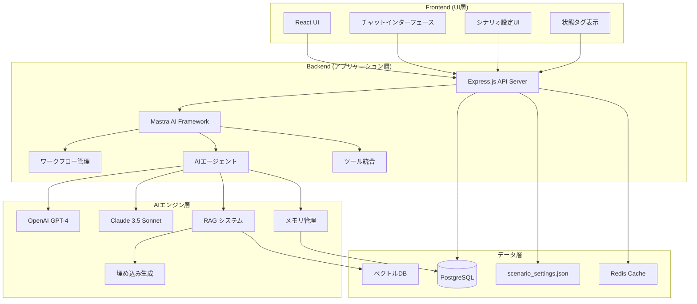

# 設計文書

## 概要

本文書は、プレイヤーが「物語の主人公」になる体験に完全に没入できる、次世代のAI駆動型TRPGプラットフォームの技術設計を概説します。Mastra AI フレームワークを中核とした実装可能な設計を提供します。

## アーキテクチャ

### システムアーキテクチャ

本システムは、責務を明確に分離した3層アーキテクチャを採用します：

1. **フロントエンド (UI層)**
   - プレイヤーが直接操作するWebインターフェース
   - React + TypeScriptで構築
   - リアルタイムチャットインターフェース
   - シナリオ設定フォーム
   - キャンペーン管理ダッシュボード

2. **バックエンド (アプリケーション層)**
   - Mastra AI フレームワークを中核とするAPIサーバー
   - Node.js (Express) + TypeScriptで構築
   - 認証とセッション管理
   - PostgreSQL による永続化機能

3. **AIエンジン層**
   - Mastra AI フレームワーク（統合エージェント・ワークフロー）
   - OpenAI GPT-4、Claude 3.5 Sonnet サポート
   - 内蔵RAG・メモリ機能による高度な対話生成
   - ワークフロー・エージェント・ツールの統合管理

### システム全体構成



### 技術スタック

**フロントエンド:**
- React + TypeScript
- WebSocketによるリアルタイム通信
- Tailwind CSS for styling

**バックエンド:**
- Node.js + Express + TypeScript
- Mastra AI Framework（エージェント・ワークフロー管理）
- Socket.io for real-time WebSocket communication
- Prisma ORM for database operations

**データベース:**
- PostgreSQL（永続化ストレージ・メモリ管理）
- Vector Database（pgvector or Pinecone）
- Redis（キャッシュ・セッション管理）

**AI統合:**
- Mastra AI Framework（統合AI管理）
- OpenAI GPT-4（メインLLM）
- Claude 3.5 Sonnet（サブLLM）
- RAG システム（知識統合）
- 埋め込み生成（OpenAI/Cohere）

## コンポーネントとインターフェース

### フロントエンドコンポーネント

#### 1. GameInterface
- **責任**: メインゲーム画面の管理
- **プロパティ**: campaignId, gameState
- **子コンポーネント**: ChatLog, ActionInput, StatusPanel

#### 2. ChatLog
- **責任**: 会話履歴の表示
- **プロパティ**: messages, isLoading
- **機能**: 自動スクロール、メッセージタイプ別スタイリング

#### 3. ActionInput
- **責任**: プレイヤーの行動入力
- **プロパティ**: onSubmit, disabled
- **機能**: 自然言語入力、送信状態管理

#### 4. StatusPanel
- **責任**: キャラクター状態タグの表示
- **プロパティ**: statusTags
- **機能**: タグの視覚的表示、ツールチップ

#### 5. ScenarioSettings
- **責任**: シナリオ設定フォーム
- **プロパティ**: onSave, initialSettings
- **機能**: フォーム検証、プレビュー機能

### バックエンドサービス

#### 1. GameService
```typescript
interface GameService {
  processPlayerAction(campaignId: string, action: string): Promise<GameResponse>
  getCampaignState(campaignId: string): Promise<CampaignState>
  createCampaign(settings: ScenarioSettings): Promise<Campaign>
  saveCampaignState(campaignId: string, state: CampaignState): Promise<void>
}
```

#### 2. MastraAgentService
```typescript
interface MastraAgentService {
  createGMAgent(scenarioSettings: ScenarioSettings): Promise<Agent>
  processAction(agent: Agent, action: string, context: GameContext): Promise<AgentResponse>
  executeWorkflow(workflowId: string, input: any): Promise<WorkflowResult>
  getAgentMemory(agentId: string): Promise<Memory[]>
  updateAgentMemory(agentId: string, memories: Memory[]): Promise<void>
}
```

#### 3. RAGService
```typescript
interface RAGService {
  embedDocument(document: string): Promise<number[]>
  searchSimilar(query: string, limit: number): Promise<RAGResult[]>
  storeKnowledge(campaignId: string, knowledge: string): Promise<void>
  retrieveContext(campaignId: string, query: string): Promise<string>
}
```

#### 4. CampaignService
```typescript
interface CampaignService {
  createCampaign(settings: ScenarioSettings): Promise<Campaign>
  loadCampaign(campaignId: string): Promise<Campaign>
  saveCampaign(campaign: Campaign): Promise<void>
  listCampaigns(userId: string): Promise<Campaign[]>
}
```

## データモデル

### シナリオ設定スキーマ (scenario_settings.json)

キャンペーン開始時に読み込まれる設定ファイル：

```json
{
  "campaignTitle": "string",
  "gmProfile": {
    "personality": "string (例: 公平無私だが皮肉屋)",
    "speechStyle": "string (例: 荘厳な口調)",
    "guidingPrinciples": ["string"]
  },
  "worldSettings": {
    "toneAndManner": "string (例: ダークファンタジー)",
    "keyConcepts": ["string"]
  },
  "opening": {
    "prologue": "string",
    "initialStatusTags": ["string"],
    "initialInventory": ["string"]
  }
}
```

### ゲーム状態スキーマ (gameState)

各キャンペーンの現在の状態を保持するデータベース/永続化オブジェクト：

```json
{
  "campaignId": "UUID",
  "characterState": {
    "name": "string",
    "statusTags": ["string"],
    "inventory": ["string"]
  },
  "worldState": {
    "currentLocation": "string",
    "time": "string"
  },
  "conversationHistory": [
    {
      "timestamp": "datetime",
      "speaker": "player|gm",
      "content": "string",
      "actionType": "action|dialogue|system"
    }
  ]
}
```

### TypeScript インターフェース定義

```typescript
interface Campaign {
  id: string
  userId: string
  title: string
  scenarioSettings: ScenarioSettings
  gameState: GameState
  createdAt: Date
  updatedAt: Date
}

interface ScenarioSettings {
  campaignTitle: string
  gmProfile: {
    personality: string
    speechStyle: string
    guidingPrinciples: string[]
  }
  worldSettings: {
    toneAndManner: string
    keyConcepts: string[]
  }
  opening: {
    prologue: string
    initialStatusTags: string[]
    initialInventory: string[]
  }
}

interface GameState {
  campaignId: string
  characterState: {
    name: string
    statusTags: string[]
    inventory: string[]
  }
  worldState: {
    currentLocation: string
    time: string
  }
  conversationHistory: Message[]
}

interface Message {
  timestamp: Date
  speaker: 'player' | 'gm' | 'system'
  content: string
  actionType: 'action' | 'dialogue' | 'system'
  metadata?: {
    diceRoll?: {
      target: number
      result: number
      reason: string
    }
    statusTagsChanged?: string[]
  }
}
```

## AI統合戦略

### Mastra AI フレームワーク統合

Mastra AI フレームワークを中核とした統合AI管理システムを採用します：

```typescript
interface MastraGameAgent {
  id: string
  name: string
  personality: string
  memory: Memory[]
  tools: Tool[]
  workflow: Workflow
}

interface GameContext {
  playerAction: string
  statusTags: string[]
  conversationHistory: Message[]
  worldSettings: WorldSettings
  gmProfile: GMProfile
  campaignId: string
  currentScene: string
}

interface AgentResponse {
  narrative: string
  statusTagChanges?: string[]
  worldStateChanges?: Record<string, any>
  diceRoll?: DiceRoll
  reasoning?: string
}

interface WorkflowResult {
  success: boolean
  outputs: Record<string, any>
  errors?: string[]
}
```

### Mastra エージェント統合

**基本的な統合方針:**
- Mastra AI フレームワークを使用してGMエージェントを構築
- 内蔵RAG・メモリ機能を活用した高度な対話システム
- ワークフロー・ツール統合による複雑なゲームロジック実装

```typescript
// Mastra AI実装例
class MastraGameMasterAgent {
  private mastra: Mastra
  private gmAgent: Agent
  private ragSystem: RAGSystem
  private memory: MemorySystem

  async initialize(scenarioSettings: ScenarioSettings): Promise<void> {
    this.mastra = new Mastra({
      provider: 'openai',
      model: 'gpt-4',
      tools: this.getGameTools(),
      workflows: this.getGameWorkflows()
    })

    this.gmAgent = await this.mastra.createAgent({
      name: 'GameMaster',
      personality: scenarioSettings.gmProfile.personality,
      systemPrompt: this.buildSystemPrompt(scenarioSettings),
      memory: true,
      ragEnabled: true
    })
  }

  async processPlayerAction(context: GameContext): Promise<AgentResponse> {
    // RAGシステムで関連する知識を検索
    const relevantContext = await this.ragSystem.searchSimilar(
      context.playerAction,
      { limit: 5, campaignId: context.campaignId }
    )

    // エージェントに行動を処理させる
    const response = await this.gmAgent.process({
      input: context.playerAction,
      context: {
        ...context,
        relevantKnowledge: relevantContext,
        previousActions: await this.memory.getRecentActions(context.campaignId)
      }
    })

    return {
      narrative: response.output,
      statusTagChanges: this.extractStatusTags(response.output),
      worldStateChanges: this.extractWorldChanges(response.output),
      diceRoll: response.metadata?.diceRoll,
      reasoning: response.reasoning
    }
  }

  private getGameTools(): Tool[] {
    return [
      {
        name: 'rollDice',
        description: 'Roll dice for difficulty checks',
        schema: z.object({
          targetValue: z.number(),
          reason: z.string()
        }),
        executor: async ({ targetValue, reason }) => {
          const roll = Math.floor(Math.random() * 100) + 1
          return {
            success: roll <= targetValue,
            roll,
            targetValue,
            reason
          }
        }
      },
      {
        name: 'updateStatusTags',
        description: 'Update character status tags',
        schema: z.object({
          addTags: z.array(z.string()),
          removeTags: z.array(z.string())
        }),
        executor: async ({ addTags, removeTags }) => {
          // 状態タグの更新ロジック
          return { updated: true }
        }
      },
      {
        name: 'storeKnowledge',
        description: 'Store campaign knowledge in RAG system',
        schema: z.object({
          knowledge: z.string(),
          category: z.string()
        }),
        executor: async ({ knowledge, category }) => {
          await this.ragSystem.storeKnowledge(knowledge, category)
          return { stored: true }
        }
      }
    ]
  }

  private getGameWorkflows(): Workflow[] {
    return [
      {
        name: 'processGameAction',
        description: 'Complete game action processing workflow',
        steps: [
          'analyzeDifficulty',
          'rollDice',
          'generateNarrative',
          'updateGameState',
          'storeMemory'
        ]
      }
    ]
  }
}
```

### RAGシステム統合

**知識管理とコンテキスト検索:**

```typescript
class CampaignRAGSystem {
  private vectorStore: VectorStore
  private embeddings: EmbeddingProvider

  async storeKnowledge(campaignId: string, knowledge: string, category: string): Promise<void> {
    const embedding = await this.embeddings.embed(knowledge)
    
    await this.vectorStore.store({
      id: `${campaignId}-${Date.now()}`,
      content: knowledge,
      embedding,
      metadata: {
        campaignId,
        category,
        timestamp: new Date()
      }
    })
  }

  async searchSimilar(query: string, options: SearchOptions): Promise<RAGResult[]> {
    const queryEmbedding = await this.embeddings.embed(query)
    
    return await this.vectorStore.search({
      embedding: queryEmbedding,
      limit: options.limit,
      filter: {
        campaignId: options.campaignId
      }
    })
  }
}
```

### メモリ管理システム

**エージェントメモリの永続化:**

```typescript
class AgentMemoryManager {
  private db: Database

  async storeMemory(agentId: string, memory: Memory): Promise<void> {
    await this.db.memories.create({
      data: {
        agentId,
        content: memory.content,
        type: memory.type,
        importance: memory.importance,
        timestamp: new Date()
      }
    })
  }

  async getRecentMemories(agentId: string, limit: number = 10): Promise<Memory[]> {
    return await this.db.memories.findMany({
      where: { agentId },
      orderBy: { timestamp: 'desc' },
      take: limit
    })
  }

  async searchMemories(agentId: string, query: string): Promise<Memory[]> {
    // セマンティック検索やキーワード検索
    return await this.db.memories.findMany({
      where: {
        agentId,
        content: {
          contains: query
        }
      }
    })
  }
}
```

## API仕様

フロントエンドとバックエンド間の通信は、以下のRESTful APIエンドポイントで行います：

### POST /campaigns
**説明**: 新規キャンペーンを作成

**リクエストボディ**: 
```json
{
  "campaignTitle": "string",
  "gmProfile": {
    "personality": "string",
    "speechStyle": "string", 
    "guidingPrinciples": ["string"]
  },
  "worldSettings": {
    "toneAndManner": "string",
    "keyConcepts": ["string"]
  },
  "opening": {
    "prologue": "string",
    "initialStatusTags": ["string"],
    "initialInventory": ["string"]
  }
}
```

**レスポンス**: 
```json
{
  "campaignId": "UUID",
  "gameState": {
    "campaignId": "UUID",
    "characterState": {
      "name": "string",
      "statusTags": ["string"],
      "inventory": ["string"]
    },
    "worldState": {
      "currentLocation": "string",
      "time": "string"
    },
    "conversationHistory": []
  }
}
```

### POST /campaigns/{campaignId}/action
**説明**: プレイヤーの行動を送信し、GMの応答と更新された状態を取得

**リクエストボディ**: 
```json
{
  "actionText": "string"
}
```

**レスポンス**: 
```json
{
  "narrative": "string",
  "diceRoll": {
    "target": "number",
    "result": "number", 
    "reason": "string"
  },
  "updatedGameState": {
    "campaignId": "UUID",
    "characterState": {
      "name": "string",
      "statusTags": ["string"],
      "inventory": ["string"]
    },
    "worldState": {
      "currentLocation": "string",
      "time": "string"
    },
    "conversationHistory": [
      {
        "timestamp": "datetime",
        "speaker": "player|gm",
        "content": "string",
        "actionType": "action|dialogue|system"
      }
    ]
  }
}
```

### GET /campaigns/{campaignId}
**説明**: 指定されたキャンペーンの最新の状態を取得

**レスポンス**: 
```json
{
  "campaignId": "UUID",
  "characterState": {
    "name": "string",
    "statusTags": ["string"],
    "inventory": ["string"]
  },
  "worldState": {
    "currentLocation": "string",
    "time": "string"
  },
  "conversationHistory": [
    {
      "timestamp": "datetime",
      "speaker": "player|gm",
      "content": "string",
      "actionType": "action|dialogue|system"
    }
  ]
}
```

### GET /campaigns
**説明**: ユーザーのキャンペーン一覧を取得

**レスポンス**: 
```json
{
  "campaigns": [
    {
      "id": "UUID",
      "title": "string",
      "createdAt": "datetime",
      "lastPlayed": "datetime",
      "worldSettings": {
        "toneAndManner": "string"
      }
    }
  ]
}
```

### WebSocket Events

リアルタイム通信用のWebSocketイベント：

#### Client → Server
- `join_campaign`: キャンペーンルームに参加
- `player_action`: プレイヤーの行動送信
- `typing_start`: 入力開始通知
- `typing_stop`: 入力終了通知

#### Server → Client  
- `gm_response`: GMの応答
- `state_update`: ゲーム状態更新
- `typing_indicator`: 他プレイヤーの入力状態
- `error`: エラー通知

## エラーハンドリング

### エラー分類

1. **ユーザーエラー**
   - 無効な入力
   - 認証失敗
   - 権限不足

2. **システムエラー**
   - データベース接続エラー
   - AI API呼び出し失敗
   - ネットワークタイムアウト

3. **ビジネスロジックエラー**
   - 無効なゲーム状態
   - キャンペーン不整合

### エラーハンドリング戦略

```typescript
class GameError extends Error {
  constructor(
    message: string,
    public code: string,
    public statusCode: number = 500
  ) {
    super(message)
  }
}

// エラー処理ミドルウェア
const errorHandler = (error: Error, req: Request, res: Response, next: NextFunction) => {
  if (error instanceof GameError) {
    res.status(error.statusCode).json({
      error: error.message,
      code: error.code
    })
  } else {
    // 予期しないエラーのログ記録
    logger.error('Unexpected error:', error)
    res.status(500).json({
      error: 'Internal server error',
      code: 'INTERNAL_ERROR'
    })
  }
}
```

## テスト戦略

### テストピラミッド

1. **ユニットテスト (70%)**
   - 各サービスクラスの個別機能
   - ユーティリティ関数
   - データ変換ロジック

2. **統合テスト (20%)**
   - API エンドポイント
   - データベース操作
   - AI サービス統合

3. **E2Eテスト (10%)**
   - 主要なユーザーフロー
   - キャンペーン作成から完了まで
   - エラーシナリオ

### テストツール

- **ユニットテスト**: Jest + Testing Library
- **統合テスト**: Supertest + Test Database
- **E2Eテスト**: Playwright
- **モック**: MSW (Mock Service Worker)

### テストデータ管理

```typescript
// テスト用のファクトリー関数
const createTestCampaign = (overrides?: Partial<Campaign>): Campaign => ({
  id: 'test-campaign-1',
  userId: 'test-user-1',
  name: 'Test Adventure',
  scenarioSettings: {
    gmPersonality: 'friendly',
    worldAtmosphere: 'fantasy',
    storyIntroduction: 'You wake up in a mysterious forest...',
    difficultyLevel: 'normal'
  },
  gameState: {
    currentScene: 'forest_clearing',
    statusTags: ['healthy', 'curious'],
    conversationHistory: [],
    worldState: {},
    lastAction: '',
    lastResponse: ''
  },
  createdAt: new Date(),
  updatedAt: new Date(),
  ...overrides
})
```

## セキュリティ考慮事項

### 認証・認可

1. **JWT ベース認証**
   - アクセストークン (短期間)
   - リフレッシュトークン (長期間)
   - トークンローテーション

2. **API キー管理**
   - 環境変数での管理
   - キーローテーション機能
   - 使用量監視

### データ保護

1. **暗号化**
   - データベース: AES-256 暗号化
   - 通信: HTTPS/WSS強制
   - APIキー: 環境変数 + Vault

2. **入力検証**
   - スキーマベース検証 (Zod)
   - SQLインジェクション対策
   - XSS対策

### プライバシー

1. **データ最小化**
   - 必要最小限のデータ収集
   - 定期的なデータクリーンアップ
   - ユーザーデータ削除機能

2. **監査ログ**
   - ユーザーアクション記録
   - システムイベント記録
   - セキュリティイベント監視

## パフォーマンス最適化

### フロントエンド最適化

1. **コード分割**
   - ルートベース分割
   - コンポーネント遅延読み込み
   - 動的インポート

2. **状態管理**
   - React Query でサーバー状態管理
   - Zustand でクライアント状態管理
   - メモ化による再レンダリング最適化

### バックエンド最適化

1. **データベース最適化**
   - インデックス戦略
   - クエリ最適化
   - 接続プール管理

2. **キャッシュ戦略**
   - Redis でセッションキャッシュ
   - AI応答の部分キャッシュ
   - 静的コンテンツ CDN

3. **AI API最適化**
   - レスポンス時間監視
   - フォールバック機能
   - レート制限対応

### 監視・メトリクス

```typescript
// パフォーマンス監視
const performanceMiddleware = (req: Request, res: Response, next: NextFunction) => {
  const start = Date.now()
  
  res.on('finish', () => {
    const duration = Date.now() - start
    metrics.recordApiLatency(req.path, duration)
    
    if (duration > 3000) {
      logger.warn(`Slow API call: ${req.path} took ${duration}ms`)
    }
  })
  
  next()
}
```

## デプロイメント戦略

### 環境構成

1. **開発環境**
   - ローカル SQLite
   - モック AI サービス
   - ホットリロード

2. **ステージング環境**
   - PostgreSQL
   - 実際の AI API (制限付き)
   - 本番同等構成

3. **本番環境**
   - 冗長化された PostgreSQL
   - 複数 AI プロバイダー
   - 監視・アラート

### CI/CD パイプライン

```yaml
# GitHub Actions example
name: Deploy
on:
  push:
    branches: [main]

jobs:
  test:
    runs-on: ubuntu-latest
    steps:
      - uses: actions/checkout@v3
      - name: Run tests
        run: npm test
      
  deploy:
    needs: test
    runs-on: ubuntu-latest
    steps:
      - name: Deploy to production
        run: |
          docker build -t ai-trpg .
          docker push $REGISTRY/ai-trpg:latest
```

## 拡張性設計

### モジュラーアーキテクチャ

1. **プラグインシステム**
   - AI プロバイダープラグイン
   - ゲームルールプラグイン
   - UI テーマプラグイン

2. **イベント駆動アーキテクチャ**
   - ゲームイベントの発行・購読
   - 非同期処理
   - 外部システム統合

### スケーラビリティ

1. **水平スケーリング**
   - ステートレス API サーバー
   - データベース読み取りレプリカ
   - ロードバランサー

2. **マイクロサービス移行準備**
   - ドメイン境界の明確化
   - API契約の定義
   - データ分離戦略

## データベース移行戦略

### 概要

本プロジェクトでは、開発効率と最終的なプロダクション要件のバランスを考慮し、段階的なデータベース移行戦略を採用します。

### 実装順序の調整

- **当初計画**: PostgreSQL + pgvector前提でのマイルストーン1実施
- **現実対応**: MVP先行実装（SQLite）後のPostgreSQL移行
- **移行時期**: Mastra AI統合（マイルストーン1）実施前に完了必須

### 段階的移行アプローチ

#### Phase 1a: SQLite MVP環境（現在）
- **目的**: 高速な開発イテレーション
- **利点**: セットアップ簡易、ローカル開発効率的
- **制限**: 単一ユーザー、ベクトル検索非対応、並行性制限

#### Phase 1b: PostgreSQL移行（次フェーズ）
- **時期**: MVP基本機能確認後、Mastra AI統合前
- **必須理由**: 
  - pgvectorによるベクトル検索（RAGシステム必須）
  - マルチユーザー並行アクセス対応
  - プロダクション級のデータ整合性

#### Phase 2: RAGシステム本格実装
- **前提**: PostgreSQL + pgvector環境
- **内容**: セマンティック検索、知識ベース構築
- **期待効果**: AIの文脈理解能力大幅向上

#### Phase 3: 本番運用最適化
- **内容**: レプリケーション、パーティショニング、監視
- **目標**: エンタープライズ級の可用性・性能

### 技術的要件

#### PostgreSQL環境
- **バージョン**: PostgreSQL 15以上
- **拡張機能**: pgvector（必須）
- **推奨設定**:
  ```sql
  -- pgvector設定
  CREATE EXTENSION vector;
  
  -- 接続プール設定
  max_connections = 200
  shared_buffers = 256MB
  ```

#### Prisma ORM対応
- **provider切り替え**: sqlite → postgresql
- **型マッピング**: 
  - String @default("{}") → Json
  - 新規: vector型サポート（pgvector）

#### CI/CD環境対応
- **開発環境**: Docker Compose によるPostgreSQL環境
- **CI環境**: GitHub Actions PostgreSQLサービス
- **本番環境**: マネージドPostgreSQL推奨

### 移行リスクと対策

1. **データ移行**
   - リスク: 既存データの損失
   - 対策: 段階的移行スクリプト、バックアップ確保

2. **型システム差異**
   - リスク: SQLite/PostgreSQL間の型不整合
   - 対策: Prismaによる抽象化、厳密な型テスト

3. **パフォーマンス差異**
   - リスク: クエリ性能の予期せぬ変化
   - 対策: EXPLAIN ANALYZE による事前検証

### 移行チェックリスト

- [ ] PostgreSQL + pgvector開発環境構築
- [ ] Prismaスキーマ完全移行
- [ ] 既存APIの回帰テスト
- [ ] ベクトル検索機能の動作確認
- [ ] CI環境のPostgreSQL対応
- [ ] パフォーマンステスト実施
- [ ] 本番移行計画書作成