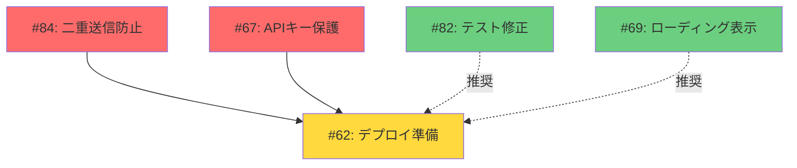

# Issue依存関係グラフ

## 🔗 現在の依存関係 (2025-01-28)

## 依存関係の種類

### 🔴 必須依存（MUST）
デプロイ前に必ず完了が必要：
- **#67 → #62**: APIキー保護なしでの本番デプロイは危険
- **#84 → #62**: セキュリティ脆弱性を本番に持ち込まない

### 🟡 推奨依存（SHOULD）  
品質向上のため推奨：
- **#82 → #62**: CI安定化後のデプロイが望ましい
- **#69 → #62**: UX改善後のリリースが望ましい

### 🟢 独立タスク
他のIssueに依存しない：
- **#79**: パフォーマンス最適化（いつでも実施可能）

## 依存関係チェックリスト

### #62 デプロイ開始前の確認
- [ ] #67 完了（APIキー保護）
- [ ] #84 完了（セキュリティ脆弱性修正）
- [ ] #82 完了確認（推奨）
- [ ] 全テストがパス

## 管理のベストプラクティス

1. **依存関係は明示的に記載**
   - Issue本文またはコメントに記載
   - プロジェクトボードのカスタムフィールド活用

2. **ラベルで状態を可視化**
   - `blocked`: 依存Issueの完了待ち
   - `ready`: 依存関係解消、作業可能

3. **定期的な依存関係レビュー**
   - 週次でブロッカーを確認
   - 不要な依存関係は削除

4. **並行作業の最大化**
   - 独立したタスクは同時進行
   - チーム開発時は依存関係を考慮した割り振り