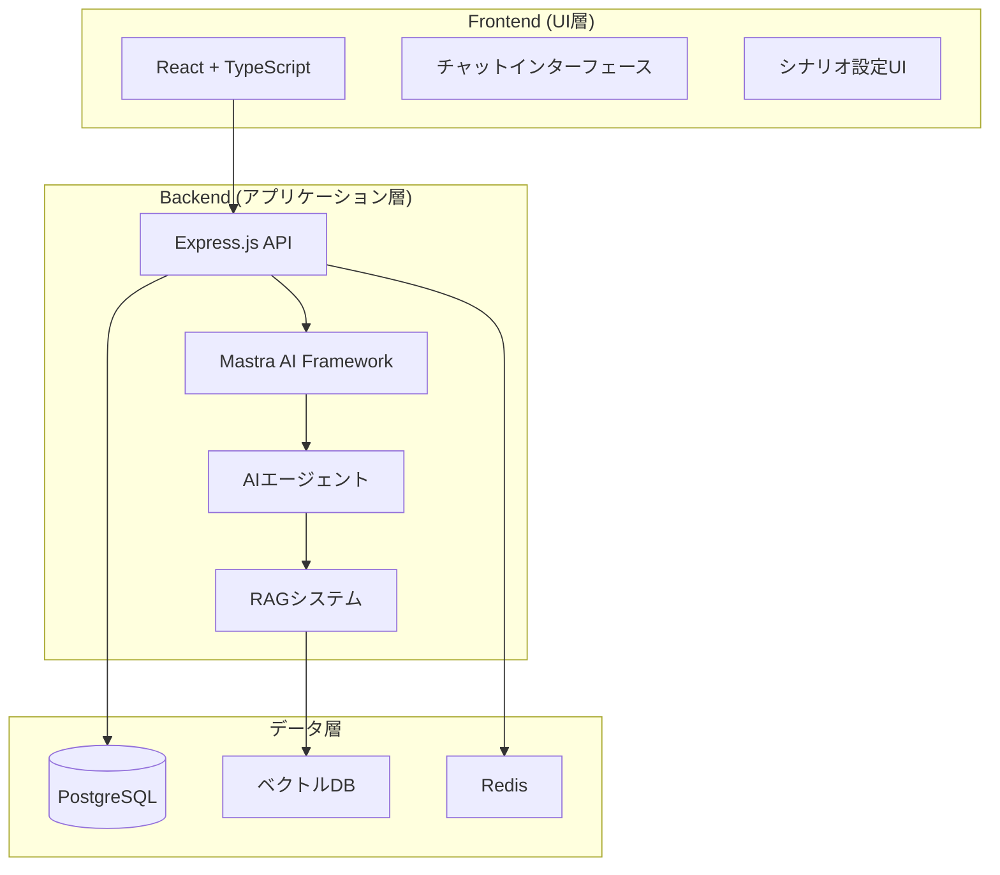

# AI-TRPG Platform プロジェクト概要

## 📋 プロジェクト全体ドキュメント索引

このドキュメントは、AI-TRPG Platformプロジェクトの全体像と各種ドキュメントへの統一的なアクセスポイントを提供します。

## 🎯 プロジェクト概要

次世代のAI駆動型TRPGプラットフォーム。プレイヤーが「物語の主人公」になる体験に完全に没入できる環境を提供します。

### 主な特徴
- 🎭 **自然言語での行動宣言**: ルールに縛られない自由な物語体験
- 🤖 **AI駆動のゲームマスター**: Mastra AI Framework による動的な物語生成
- 📊 **状態タグシステム**: 数値ではなく記述的なタグでキャラクター状態を管理
- 💾 **永続的なキャンペーン管理**: いつでも中断・再開可能な物語
- 🎮 **直感的なUI**: 物語への没入を妨げないシンプルなインターフェース

## 📚 ドキュメント構造

### 🏗️ プロジェクト設計・仕様
| ドキュメント | 説明 | 対象読者 |
|-------------|------|----------|
| [要件定義](../.kiro/specs/ai-trpg-platform/requirements.md) | システム要件とユーザーストーリー | 全開発者 |
| [設計文書](../.kiro/specs/ai-trpg-platform/design.md) | アーキテクチャと技術設計 | 開発者・アーキテクト |
| [実装計画](../.kiro/specs/ai-trpg-platform/tasks.md) | 段階的実装タスクリスト | 開発者・PM |

### 🛠️ 開発・運用ガイド
| ドキュメント | 説明 | 対象読者 |
|-------------|------|----------|
| [開発ガイド](../CLAUDE.md) | Claude AI向け開発指針 | AI開発者 |
| [開発ワークフロー](./development-workflow.md) | Issue作成から実装完了までの標準フロー | 全開発者 |
| [CI戦略](../CI-STRATEGY.md) | 継続的インテグレーション戦略 | DevOps・開発者 |

### 🔧 技術ドキュメント
| ドキュメント | 説明 | 対象読者 |
|-------------|------|----------|
| [バックエンドREADME](../backend/README.md) | バックエンド開発環境・API仕様 | バックエンド開発者 |
| [フロントエンドREADME](../frontend/README.md) | フロントエンド開発環境・構成 | フロントエンド開発者 |
| [データベース設計](../backend/DATABASE.md) | DB設計・セットアップガイド | バックエンド開発者 |
| [Mastra AI統合](../backend/MASTRA_AI_INTEGRATION.md) | AI統合実装詳細 | AI統合開発者 |
| [RAGシステム](../backend/docs/RAG_SYSTEM.md) | 検索拡張生成システム | AI・バックエンド開発者 |

### 🚀 運用・スクリプト
| ドキュメント | 説明 | 対象読者 |
|-------------|------|----------|
| [スクリプトガイド](../scripts/README.md) | 開発効率化スクリプト | 全開発者 |

## 🏛️ アーキテクチャ概要



## 🛣️ 開発ロードマップ

### マイルストーン1: Mastra AI統合とコアエンジン基盤 (2週間)
- Mastra AI フレームワーク導入
- GMエージェント・ゲームツール実装
- RAGシステム・メモリ管理構築

### マイルストーン2: MVP開発 (3週間)
- フロントエンド基盤構築
- UIコンポーネント実装
- ゲームフロー統合

### マイルストーン3: 機能拡張と永続化 (2週間)
- ユーザー管理・認証システム
- キャンペーン管理機能
- シナリオ設定UI

### マイルストーン4: ポリッシュとデプロイ (1週間)
- 品質向上・エラーハンドリング
- パフォーマンス最適化
- 本番デプロイ

## 🚀 クイックスタート

### 開発環境セットアップ

1. **リポジトリクローン**
   ```bash
   git clone [repository-url]
   cd ai-trpg-platform
   ```

2. **バックエンドセットアップ**
   ```bash
   cd backend
   npm install
   cp .env.example .env
   # .envファイルを編集してAPI keyを設定
   npm run db:setup
   npm run dev
   ```

3. **フロントエンドセットアップ**
   ```bash
   cd frontend
   npm install
   cp .env.local.example .env.local
   npm run dev
   ```

### 主要コマンド

```bash
# 全体プロジェクト状況確認
./scripts/project-status-dashboard.sh --detailed

# 並列実行可能Issue選定
./scripts/select-parallel-safe-issues.sh --recommend

# 全PRの健全性チェック
./scripts/check-all-prs.sh

# Conflict予防チェック
./scripts/check-issue-conflicts.sh --files "path1,path2"
```

## 🔧 技術スタック

### フロントエンド
- **フレームワーク**: React + TypeScript + Vite
- **状態管理**: Zustand
- **スタイリング**: Tailwind CSS
- **リアルタイム**: Socket.io-client

### バックエンド
- **ランタイム**: Node.js + Express + TypeScript
- **AI統合**: Mastra AI Framework
- **データベース**: PostgreSQL + Prisma ORM
- **リアルタイム**: Socket.io
- **認証**: JWT

### AI・データ
- **AIフレームワーク**: Mastra AI Framework
- **LLMプロバイダー**: OpenAI GPT-4、Claude 3.5 Sonnet
- **ベクトルDB**: pgvector / Pinecone
- **キャッシュ**: Redis

## 📊 プロジェクト状況

### 現在の進捗
- ✅ プロジェクト設計・仕様策定完了
- ✅ 技術スタック選定完了
- ✅ 開発環境・CI/CD構築完了
- 🔄 Mastra AI統合実装中
- ⏳ MVP開発準備中

### 次のアクション
1. Mastra AI フレームワーク導入 (タスク1.1)
2. GMエージェント実装 (タスク1.2)
3. ゲーム専用ツール実装 (タスク1.3)

## 🤝 貢献ガイドライン

### 開発フロー
1. [開発ワークフロー](./development-workflow.md)に従ってIssue作成
2. Conflict予防チェック実行
3. @claudeコマンドで実装依頼
4. PR作成・レビュー・マージ

### コーディング規約
- TypeScript strict mode使用
- ESLint + Prettier による自動フォーマット
- Jest による単体テスト必須
- コミットメッセージはConventional Commits準拠

## 📞 サポート・連絡先

### トラブルシューティング
- 開発環境問題: [バックエンドREADME](../backend/README.md) / [フロントエンドREADME](../frontend/README.md)
- AI統合問題: [Mastra AI統合ガイド](../backend/MASTRA_AI_INTEGRATION.md)
- ワークフロー問題: [開発ワークフロー](./development-workflow.md)

### よくある質問
- **Q: どのタスクから始めるべきか？**
  - A: [実装計画](../.kiro/specs/ai-trpg-platform/tasks.md)のマイルストーン1から順次実行

- **Q: Conflict予防はどうすればよいか？**
  - A: [開発ワークフロー](./development-workflow.md)のPhase 3を参照

- **Q: AI統合でエラーが発生する**
  - A: [Mastra AI統合ガイド](../backend/MASTRA_AI_INTEGRATION.md)のトラブルシューティング参照

---

**最終更新**: 2025-01-18  
**バージョン**: 1.0.0  
**メンテナー**: AI-TRPG Platform Development Team